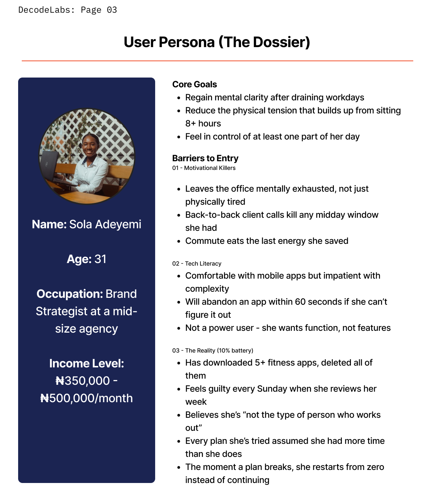
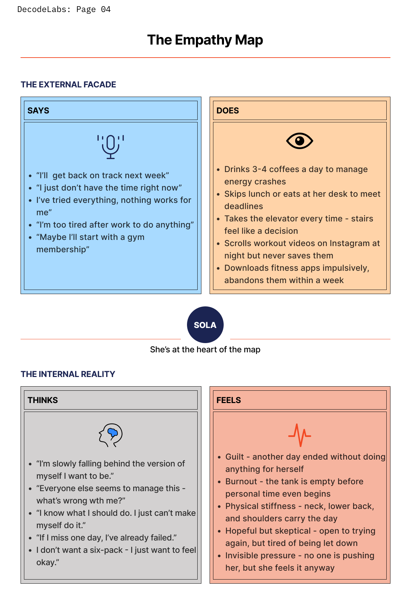

# task-1
# Project 1 — The Empathy Map
### DecodeLabs UI/UX Internship | Batch 2026
**Designer:** Oluwatosin Olaniyan

---

## Project Overview

| Field | Detail |
|---|---|
| **Track** | UI/UX Product Design |
| **Project** | 01 — The Empathy Map |
| **Tool** | FigJam |
| **Duration** | Week 1 |
| **Role** | UX Researcher |

---

## The Brief

A fitness startup wants to launch an app for busy office professionals
who struggle to find time for exercise. Before designing a single pixel,
the team needed to understand the user's real pain deeply.

> *"The enemy is time. Solve for the user who cannot leave their desk —
> not the user who lives at the gym."*
> — DecodeLabs Task Briefing

---

## My Process

### Step 1 — Scenario Understanding
Identified the core problem space: the **time-poor professional**.
- Current state: 40+ hour work week
- Perception: zero minutes available for personal health
- Challenge: prove psychological understanding of the user

### Step 2 — Problem Identification
Analysed the 3 friction points that cause this audience to
abandon fitness apps:

| # | Friction Point | Why It Matters |
|---|---|---|
| 01 | Workouts are too long | A 45-min routine is dead on arrival for someone with back-to-back meetings |
| 02 | Interfaces are too loud & gamified | Streaks and penalties feel like another job, not relief |
| 03 | Requires a gym they can't reach | If leaving the desk is the requirement, they've already lost |

### Step 3 — User Persona (The Dossier)
Created a specific, named persona to move beyond generalized data.

**Name:** Sola Adeyemi
**Age:** 31
**Occupation:** Brand Strategist at a mid-size agency
**Income:** ₦350,000 – ₦500,000/month

**Core Goals** *(deeper than vanity — the human goal):*
- Regain mental clarity after draining workdays
- Reduce physical tension from sitting 8+ hours
- Feel in control of at least one part of her day

**Barriers to Entry:**
- 01 Motivation Killers: back-to-back calls, commute exhaustion
- 02 Tech Literacy: comfortable with mobile, impatient with complexity
- 03 The Reality: 5+ apps downloaded and deleted, restarts from zero when plan breaks

### Step 4 — The Empathy Map
Built a 4-quadrant map separating external and internal experience:

| Quadrant | Layer | Key Insights |
|---|---|---|
| **SAYS** | External | "I'll start Monday." / "I just don't have the time." |
| **DOES** | External | Drinks 3–4 coffees, skips lunch, downloads apps impulsively |
| **THINKS** | Internal | "I'm falling behind the version of myself I want to be." |
| **FEELS** | Internal | Guilt, burnout, physical stiffness — especially at 6:00 PM |

---

## Key Insight

> Sola doesn't have a discipline problem. She has a **design problem.**
> Every solution she's encountered was built for someone with more time,
> more energy, and more forgiveness in their schedule. The app this
> startup needs to build must treat 5 minutes as a complete win —
> not a consolation prize. It must speak to her at 6 PM when she's
> depleted, not at 6 AM when she's optimistic. And it must never
> punish her for being human.

---

## Deliverables Checklist

- [x] Scenario Understanding — grasped the time-poor reality
- [x] Human Definition — created a specific, believable persona
- [x] Empathy Mapping — identified the external and internal struggle
- [x] Key Insight — synthesized research into one actionable statement

---

## 🔗 View Full Project

👉 **[Open in FigJam](https://www.figma.com/board/G918HrmTamnS6OC8u4sweO/DecodeLabs-Project-1?node-id=0-1&t=EKyHRI6CDg6Rhvkd-1)** 

---

## Tools Used
- FigJam — research board, empathy mapping, persona creation

---

## Designer

**Oluwatosin Olaniyan** — UI/UX Product Designer
🌍 Lagos, Nigeria
🔗 [LinkedIn](https://www.linkedin.com/in/oluwatosin-olaniyan-59089429b/?lipi=urn%3Ali%3Apage%3Ad_flagship3_profile_view_base_contact_details%3BcZtMEqZvSi2rAGn7Br8GAA%3D%3D) | [X / Twitter](https://x.com/ItsOlatee)

*Part of the DecodeLabs Industrial Training Kit — Batch 2026*
